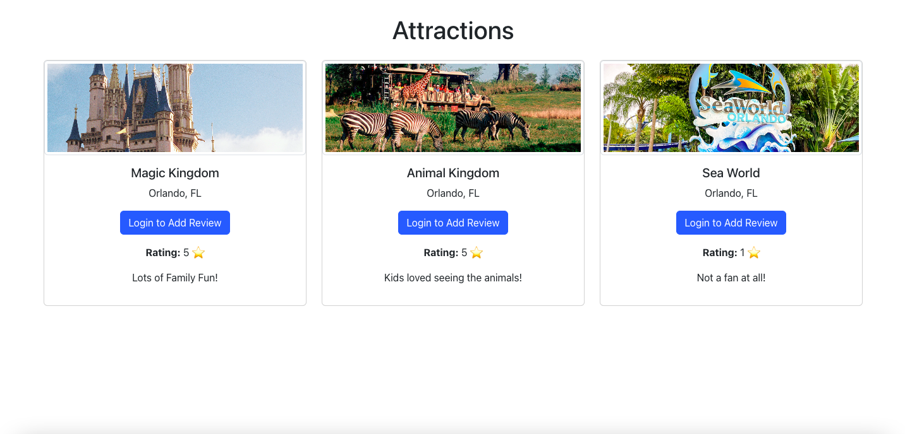

# Review Spotter

A React application that allows users to browse different attractions and leave reviews with star ratings. Only logged-in users can add, edit, or delete their own reviews. The site uses Firebase for authentication and Firestore for storing attractions and reviews. The design is styled with Bootstrap for responsive layouts.

## Table of contents

- [Technologies](#technologies)
- [Project Structure](#project-structure)
- [Setup Instructions](#setup-instructions)
- [Screenshots](#screenshots)
- [Live Demo](#live-demo)
- [Contact](#contact)

## Technologies

- React, Firebase (Authentication & Firestore), Bootstrap, and CSS.

## Project Structure

src/  
├── components/  
│   ├── ReviewForm.js            # Form for adding and editing reviews  
│   └── ReviewList.js            # Displays reviews for each attraction  
├── pages/  
│   ├── Home.js                  # Main page that displays all attractions and their reviews  
│   └── Admin.js                 # Admin page for adding new attractions  
├── firebase/  
│   └── firebase.js              # Firebase configuration and utilities  
├── App.js                       # Entry point for the app  
└── index.js                     # Renders the app into the DOM  

## Setup Instructions

1. Clone the repository:

   git clone https://github.com/ibsaajadam/review-spotter.git

2. Navigate to the project directory:

   cd review-spotter

3. Install dependencies:

   npm install

4. Start the development server:

   npm start

   The app will now be running at http://localhost:3000.

## Screenshots

  

## Live Demo

View the live demo here: [Live Demo](https://review-spotter.netlify.app/)

## Contact

Created by [Ibsaa J Adam](https://github.com/ibsaajadam) - feel free to contact me!

You can also find me on:

- [Linkedin](https://www.linkedin.com/in/ibsaajadam/)  
- [Github](https://github.com/ibsaajadam)
